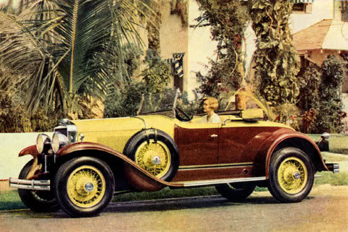

## Motivation 

Driving an oldtimer from the 1920s can be a perilous endeavor. Differences in technology between the 1920s and the 21. century make it difficult for people who are used to modern cars to estimate the necessary stopping distance of their oldtimer.
__The__ __Safe__ __Gatsby__ provides you with an estimate of the stopping distance given the velocity of yout oldtimer based on a statistical model.



--- .class #id 

## Dataset

The dataset used for the model consists of 50 observations of speed and stopping distance of 1920s cars. It is part of the R package _datasets_ and is free to use.
```{r}
library(datasets)
data("cars")
summary(cars)
```

---

## The Model

$$distance = speed + speed^2 $$

```{r, echo=FALSE, fig.height=7, fig.width=12}
library(ggplot2)
qplot(x=speed, y=dist, data=cars, geom=c("point", "smooth"),
      method="lm", formula=y~x+I(x^2)-1, se=F,
      main="Stopping Distance of 1920s cars",
      xlab = "MPH", ylab = "FT" )
```


---

## Try it!

URL: [https://jimbob.shinyapps.io/TheSafeGatsby](https://jimbob.shinyapps.io/TheSafeGatsby)

Just enter the speed in Miles per Hour and calculate the estimated stopping distance!

---


